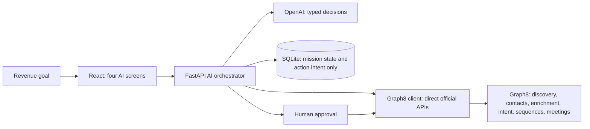
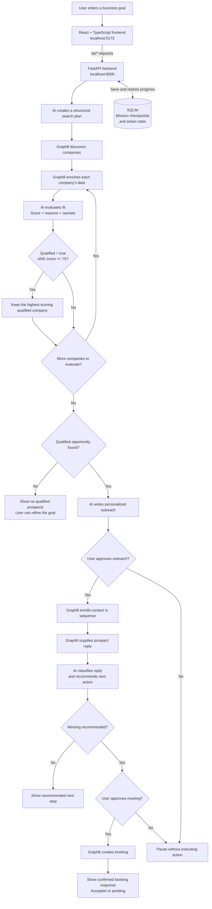

# AI Revenue Autopilot

**Graph8 is the revenue engine. Autopilot is the AI brain.**

A four-screen hackathon application built with React, TypeScript, Vite, Tailwind, shadcn/ui primitives, FastAPI, and OpenAI structured outputs. No CRM tables, campaign builder, or revenue dashboard.

## Run the demo

Requires Node 20.19+ and Python 3.11+.

```bash
npm install
python3 -m venv .venv
.venv/bin/pip install -r backend/requirements.txt
cp .env.example .env
```

Start both services with **`npm run demo`**, or run these in two terminals from the repository root:

```bash
.venv/bin/uvicorn backend.app.main:app --host 127.0.0.1 --port 8000
```

```bash
npm run dev
```

Open **http://127.0.0.1:5173**. API documentation: **http://127.0.0.1:8000/docs**.

`DEMO_MODE=true` is the default. No API keys, internet connection, or provider calls are needed after dependencies are installed. No browser-side fallback silently replaces failed live calls with demo data.

## Demo presentation

1. Keep the prefilled SaaS discovery goal and click **Generate AI plan**.
2. Review the plan and click **Start Mission**.
3. Watch the Command Center: **128 prospects → 34 qualified → top score 92 → personalized outreach**.
4. Open **Lead Intelligence** to see the message, the simulated reply **“I'd like to see a demo”**, and **INTERESTED → BOOK_MEETING**.
5. Click **Approve & book meeting**. Without approval, the runner remains paused at 90%; declining pauses without an action.
6. The result shows **128 / 34 / 34 / 1 / 1**. **Open in Graph8** opens the real Graph8 workspace; simulated records are never written there.

Demo planning deliberately replays this fixed SaaS scenario, even if the text is edited. Live planning uses the entered goal. All simulated data and external actions are labeled. Fictional contact domains use `.example`.

## Architecture



The browser only calls `/ai/*`. Provider credentials stay in Python. The Graph8 adapter is invoked inside AI orchestration; there are no local `/contacts`, `/companies`, `/campaigns`, or generic proxy routes. Graph8 owns the revenue records and delivery. SQLite stores resumable AI workflow state and the evidence used for decisions, not a second CRM.

- `src/App.tsx`: four-screen application and mission lifecycle UI.
- `src/components/ui/`: local shadcn/ui Button and Card primitives (Radix Slot, CVA, Tailwind).
- `src/lib/`: TypeScript contracts and the API client.
- `backend/app/schemas.py`: validated AI, mission, and action contracts.
- `backend/app/intelligence.py`: OpenAI Responses API structured outputs and deterministic demo decisions.
- `backend/app/graph8.py`: server-only Graph8 integration.
- `backend/app/agent.py`: mission planning, qualification, orchestration, and approval policy.
- `backend/app/store.py`: mission checkpoints and durable write intent.
- `docs/graph8-integration.md`: official endpoint map and live setup.

Progress is real server state polled by the browser. Each advance performs one stage (one company per qualification step). Reloading a demo restores its latest checkpoint. Keep the browser open to advance; this hackathon runner is not a background job service. Run **one Uvicorn worker** so the action lock covers all requests.

## Technical workflow for the demo



### Presentation script

“The user describes their ideal customer in our React frontend. FastAPI coordinates the workflow. OpenAI creates the plan, evaluates company fit, writes outreach, and interprets replies. Graph8 supplies company data and executes outreach and bookings. A company qualifies only when AI marks it qualified and its score is at least 75. We select the strongest qualified opportunity for outreach. Users approve external actions, while SQLite stores progress so the mission can resume.”

### Demo versus live execution

This diagram describes the live workflow. With `DEMO_MODE=true`, provider responses and external actions are simulated: **128 prospects, 34 qualified companies, and a top score of 92**. No real outreach or bookings occur in demo mode. In live mode, a pending booking still requires host confirmation.

Qualification measures business fit against the user's goal using available company evidence. The current AI scoring prompt has no fixed point weights and does not explicitly verify budget, purchasing authority, or purchase timeline. A qualified prospect is a candidate for outreach, not a confirmed buyer.

## Live mode

Set `DEMO_MODE=false`, `GRAPH8_API_KEY`, `GRAPH8_BASE_URL`, `OPENAI_API_KEY`, and `AUTOPILOT_API_TOKEN` in `.env`; restart FastAPI. Enter the local access token in the mission screen. `OPENAI_MODEL` defaults to `gpt-4.1-mini` and may be changed to an accessible model supporting structured outputs.

Live mode searches up to the requested 100-company maximum, enriches and scores the returned companies, and selects the strongest qualified opportunity for a personalized conversation. It does not automatically contact the entire search result set. The live result's outreach metric is **enrollment**, not confirmed delivery.

For personalized outreach, configure an existing Graph8 single-email live sequence, its **stop on reply** setting, and two text custom fields used as its subject/body merge tokens. Set `GRAPH8_SEQUENCE_ID`, `GRAPH8_SUBJECT_FIELD_ID`, and `GRAPH8_BODY_FIELD_ID`. Enter the existing Graph8 list ID when approving outreach. Autopilot resolves or creates the prospect in Graph8, sets the AI-generated subject/body in those fields, and enrolls that contact via Graph8. It never creates a campaign management UI or silently substitutes generic copy.

Real replies come from the Graph8 inbox for the configured sequence, matching the prospect's sender email and mission creation time. The UI polls every 15 seconds while waiting. Booking requires an existing Graph8 event type ID and an agreed future meeting time. The Graph8 booking response must confirm an accepted/pending record before the mission reports success. Check pending bookings in Graph8 for host confirmation.

Follow [the live integration guide](docs/graph8-integration.md) for exact contracts and setup. Live provider calls have not been exercised against your account; credentials, scopes, mailbox configuration, credits, and event availability are workspace-specific.

## Reliability and security

- `.env` and local database files are ignored. Never put provider credentials in `VITE_*` variables.
- A previously hardcoded key in `graph8_test.py` was removed. Rotate that exposed key in Graph8. The check now runs explicitly and reads its key from the environment.
- All live AI routes require the server-configured local access token. The browser holds it in memory only. The default demo is intended for local use; add user auth and rate limiting before public deployment.
- Pydantic validates goals, scores, classification enums, and actions. Unsubscribe/negative replies cannot become meeting recommendations. Untrusted company/reply content is passed as evidence, never system instructions.
- Approval is enforced on the server. Repeated completed booking approvals return the existing result.
- Live mutations record durable write intent before calling Graph8. An uncertain failure blocks replay and requires inspection in Graph8; the app does not claim exactly-once guarantees from unsupported provider idempotency behavior. Reconcile the outcome before starting another mission for that prospect.
- No retries of provider mutations. Timeouts and provider errors are surfaced without keys or raw provider response bodies.
- Keyboard focus, mobile layouts, reduced-motion support, loading states, empty states, errors, and refresh recovery are included.

## Verification

```bash
npm run build
.venv/bin/python -m pytest backend/tests -q
npx playwright install chromium
npm test
npm run format:check
```

Playwright starts both servers and tests desktop and mobile flows, approval, reload recovery, error recovery, and the Graph8 handoff. `npm test` must have permission to bind localhost ports and launch a browser. Tests use synthetic data, never live API credentials.
