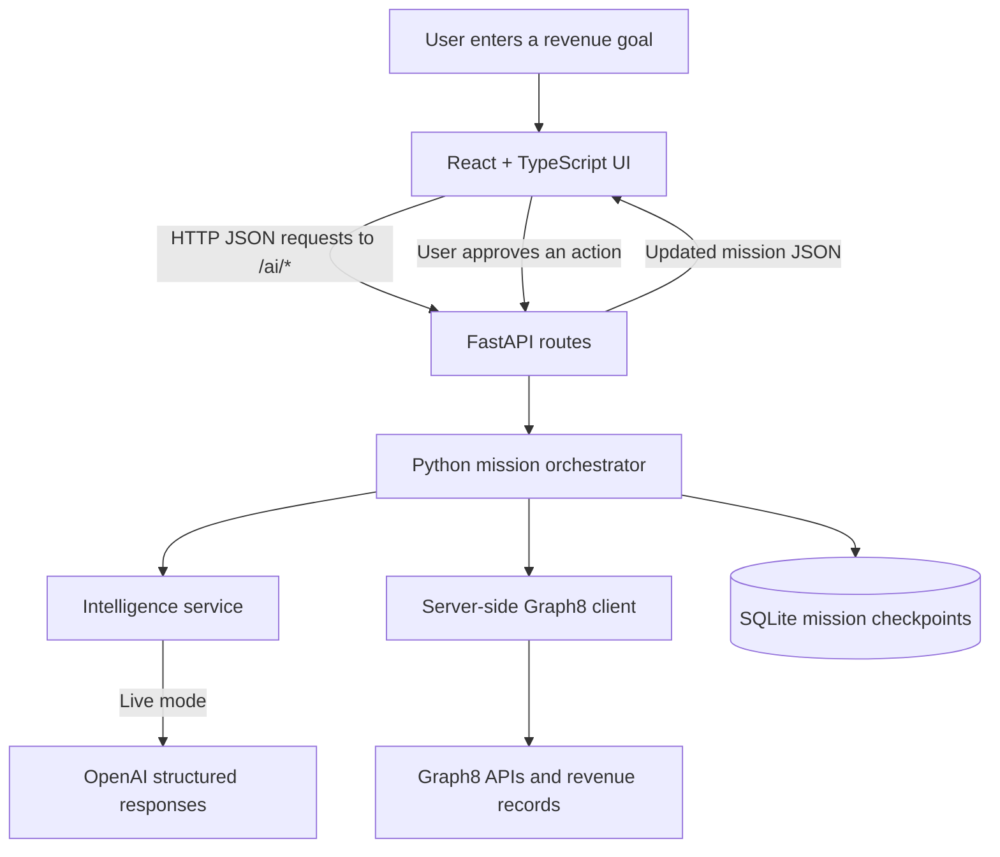
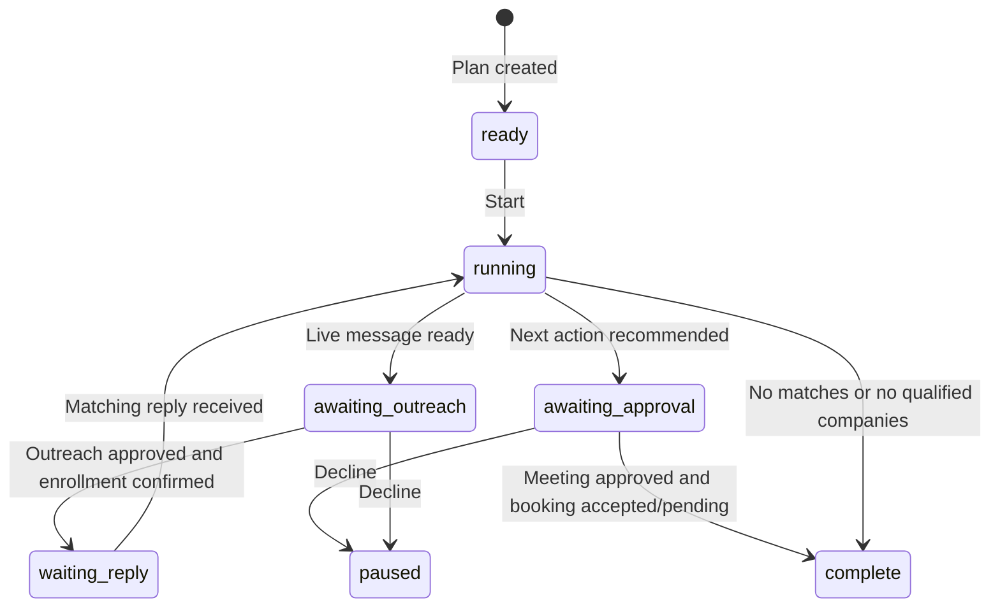

# How AI Revenue Autopilot works technically

This document explains the code currently implemented in this repository, including what is simulated and what happens in live mode.

**React displays the mission. FastAPI coordinates the decisions. OpenAI generates intelligence. Graph8 searches revenue data and executes approved revenue actions.**

## 1. The architecture



The frontend runs on port **5173**. FastAPI runs on port **8000**. During development, Vite forwards browser requests beginning with `/ai` to FastAPI.

The browser never receives the Graph8 or OpenAI API key. Python calls Graph8 directly through its client; the application does not expose a second set of contact/company/campaign CRUD endpoints.

## 2. Which file does what?

| File                                                       | Responsibility                                                                 |
| ---------------------------------------------------------- | ------------------------------------------------------------------------------ |
| [src/App.tsx](src/App.tsx)                                 | Four screens, goal input, mission state, polling, and approval buttons         |
| [src/lib/api.ts](src/lib/api.ts)                           | Browser HTTP requests, access-token header, timeout, and readable errors       |
| [src/lib/types.ts](src/lib/types.ts)                       | TypeScript contracts for mission responses                                     |
| [src/components/ui](src/components/ui)                     | Shared shadcn/ui-style primitives                                              |
| [backend/app/main.py](backend/app/main.py)                 | FastAPI routes, live authorization, request serialization, and error responses |
| [backend/app/agent.py](backend/app/agent.py)               | The mission state machine: what happens next and when execution must stop      |
| [backend/app/intelligence.py](backend/app/intelligence.py) | Planning, scoring, personalization, reply classification, and recommendations  |
| [backend/app/graph8.py](backend/app/graph8.py)             | Authenticated HTTP calls to Graph8's official APIs                             |
| [backend/app/schemas.py](backend/app/schemas.py)           | Pydantic input/output models and validation constraints                        |
| [backend/app/store.py](backend/app/store.py)               | Save and restore mission checkpoints in SQLite                                 |
| [backend/app/config.py](backend/app/config.py)             | Load configuration from environment variables and `.env`                       |
| [scripts/dev.mjs](scripts/dev.mjs)                         | Start Vite and FastAPI together with `npm run demo`                            |

## 3. From a goal to a plan

The user enters:

> Find 50 SaaS companies in the USA with 50–500 employees that could benefit from our AI automation platform.

Clicking **Generate AI plan** sends:

```http
POST /ai/mission/plan
Content-Type: application/json
```

```json
{
  "goal": "Find 50 SaaS companies in the USA with 50–500 employees that could benefit from our AI automation platform."
}
```

The request moves through:

```text
App.tsx
  → api.plan(goal)
  → main.py: plan()
  → agent.py: Agent.create()
  → intelligence.py: Intelligence.plan()
```

In live mode, OpenAI converts the goal into a validated `Plan`: industry, country, minimum/maximum employee count, target count, summary, and suggested steps. The target is capped at 100. The backend checks that the employee range is valid.

`Agent.create()` then generates a mission UUID, sets its status to `ready`, records the first activity event, and saves the mission to SQLite. React receives this mission and displays the plan for review.

In demo mode, planning returns the fixed SaaS scenario without calling OpenAI. Editing the goal does not change that scripted scenario.

## 4. How agent orchestration actually works

The application uses a **Python state machine**, not a collection of independently running autonomous processes. Labels such as “Discovery agent” and “Strategy agent” represent responsibilities inside that workflow.

Clicking **Start Mission** sends:

```json
{
  "mission_id": "<mission UUID returned by the plan endpoint>",
  "command": "start"
}
```

This goes to `POST /ai/agent/run`. The server changes the status from `ready` to `running`.

React then calls the same endpoint with `command: "advance"`. Each request executes the next stage and returns updated mission JSON. During qualification, each request evaluates one company.

| Stage in `agent.py` | Work performed                                                                 | What happens afterward                                         |
| ------------------- | ------------------------------------------------------------------------------ | -------------------------------------------------------------- |
| `0`                 | Discover matching companies                                                    | Move to qualification, or complete with no results             |
| `1`                 | Enrich and score candidates; find a contact at the strongest qualified company | Repeat until candidates are evaluated, then personalize        |
| `2`                 | Generate a subject and email body                                              | Move to outreach preparation                                   |
| `3`                 | Prepare outreach                                                               | Live mode waits for outreach approval; demo simulates outreach |
| `4`                 | Obtain a prospect reply and classify it                                        | Wait if no live reply exists; otherwise move to recommendation |
| `5`                 | Recommend the next action                                                      | Wait for human review/approval                                 |



The demo skips the live outreach-approval branch and produces its simulated reply during subsequent advances. It still requires approval for its simulated booking.

The generated plan is **not executable code**. The actual workflow stages and permitted external operations are defined in Python, so model output cannot invent API routes or run arbitrary tools.

## 5. How live discovery and qualification work

The Graph8 client translates the plan into filters and calls `POST /search/companies`:

```json
{
  "filters": [
    { "field": "description", "operator": "contains", "value": ["SaaS"] },
    { "field": "country", "operator": "any_of", "value": ["United States"] },
    { "field": "employee_count", "operator": "between", "value": [50, 500] }
  ],
  "page": 1,
  "limit": 50
}
```

For each returned candidate, the orchestrator:

1. Reads company enrichment through Graph8 when a domain is available.
2. Attempts to fetch tracked-page context from Graph8's intent surface.
3. Sends the company and available evidence to the AI scorer.
4. Counts the company as qualified only when `qualified` is true **and** its score is at least 75.
5. Retains the highest-scoring qualified company as the top lead.

Tracked pages are labeled as context, not proof that a company intends to buy. Missing intent access is recorded as unavailable evidence.

After qualification, Graph8 contact search finds a potential decision maker at the top company's domain. The current search targets CEO, CTO, and VP Operations titles and selects the first returned contact.

The current live workflow evaluates the returned company batch and pursues **one top opportunity**. It does not send outreach to every qualified company. If the strongest company has no usable contact email, outreach cannot proceed automatically.

## 6. How OpenAI produces usable results

`Intelligence.generate()` calls `AsyncOpenAI.responses.parse()` with:

- A system instruction describing the specific task.
- JSON input containing the goal and relevant evidence.
- A Pydantic model supplied as `text_format`.

The output schemas are:

| Model           | Main fields                                       |
| --------------- | ------------------------------------------------- |
| `Plan`          | Target criteria, summary, and steps               |
| `Score`         | Score from 0–100, qualified flag, reasons, caveat |
| `Message`       | Subject and body                                  |
| `ReplyAnalysis` | Classification, confidence from 0–1, explanation  |
| `NextAction`    | Action, reason, requires-approval flag            |

The response is parsed into the requested model before the workflow uses it. This gives the application predictable field names and validated types. It does **not** prove the model's judgment is correct: scores and confidence values are AI assessments, not measured conversion probabilities.

Company information and reply text are supplied as untrusted evidence. Prompts tell the model not to treat that content as instructions or invent unsupported facts. External actions remain controlled by server-side code and approval checks.

## 7. How the personalized email reaches Graph8

The AI generates the message, but Graph8 delivers it.

Before live outreach, configure an existing Graph8 sequence with one plain-text `EMAIL` step using `MANUAL_TEMPLATE`. Its subject and body must refer to two configured contact custom fields using Graph8 merge tokens.

For example, if Graph8 reports the field slugs as `ai_subject` and `ai_body`, configure:

```text
Sequence subject: {{ai_subject}}
Sequence body:    {{ai_body}}
```

Actual field slugs must come from Graph8; these names are illustrative.

When the user approves outreach with a Graph8 list ID, the backend:

1. Validates the configured fields and existing sequence, including its live status and stop-on-reply behavior.
2. Resolves the prospect's email to an existing Graph8 contact, or creates the contact in Graph8 if needed.
3. Adds the contact to the specified Graph8 list.
4. Writes the approved AI subject and body through `PATCH /fields/{column_id}/values`.
5. Enrolls the contact through `POST /sequences/{sequence_id}/contacts`.
6. Waits for a reply.

There is no local mail server, email-delivery implementation, or campaign builder. A confirmed enrollment means Graph8 accepted the contact into its sequence; it is **not proof of email delivery**.

## 8. How a reply becomes a next action

In live mode, the client reads the Graph8 inbox for the configured sequence. The orchestrator looks for messages that:

- Come from the prospect (`responder: "OTHER"`).
- Are not drafts.
- Match the selected prospect's sender email.
- Have a date at or after mission creation.

The newest matching message is passed to reply classification.

For the demo reply:

```text
I'd like to see a demo
```

The scripted analysis is `INTERESTED`, with confidence `0.98`. The recommendation becomes `BOOK_MEETING`.

Some decisions use deterministic Python rules in both modes:

| Classification                         | Recommendation    |
| -------------------------------------- | ----------------- |
| `UNSUBSCRIBE` or `NOT_INTERESTED`      | `STOP_OUTREACH`   |
| `OUT_OF_OFFICE`                        | `WAIT`            |
| `QUESTION`                             | `ANSWER_QUESTION` |
| `UNKNOWN`                              | `HUMAN_REVIEW`    |
| `INTERESTED` with confidence below 0.8 | `HUMAN_REVIEW`    |

Higher-confidence interested replies use the AI next-action service in live mode. Every returned recommendation is marked as requiring approval.

The application currently executes approved bookings. Other recommendations are handed to the user for review in Graph8; there is no automatic answer-sending or suppression-management workflow implemented here.

## 9. What meeting approval does

The UI sends `command: "approve"` to `/ai/agent/run`.

The server requires an existing mission awaiting approval and a stored `BOOK_MEETING` recommendation. Live requests also need:

- A real Graph8 event type ID.
- A future meeting time with a timezone, agreed with the prospect.
- The prospect's email from the mission.

The browser converts the selected local time to an ISO timestamp. Python validates it and calls Graph8's `POST /appointments/bookings` with the event type, start time, and attendee information.

If Graph8 returns an accepted or pending booking, the mission records the result and completes. A pending booking can still require host confirmation; completion does not mean the prospect attended a meeting.

Demo approval creates a local simulated booking receipt. It does not contact Graph8 or send an invitation.

## 10. What makes the activity feed “real time”?

The UI uses **HTTP polling**, not WebSockets or server-sent events.

- While running, React schedules an advance approximately 1.1 seconds after receiving the previous state.
- While waiting for a live reply, it schedules an advance after 15 seconds.
- The next request is scheduled after the previous response, so slow provider calls lengthen the interval.
- Polling stops when an error is displayed or the mission waits for approval, pauses, or completes.

Each server stage appends an event with an ID, timestamp, agent label, title, and detail. React renders those events and the progress value from the returned mission.

Progress percentages represent workflow milestones, not an estimate of remaining runtime. The agents do not continue advancing independently after the browser closes. Graph8 can still deliver already-enrolled outreach because its execution is external to this app.

## 11. Persistence and failure recovery

SQLite stores a `missions` table with an ID and JSON payload. The payload includes the plan, stage, status, remaining candidates, selected lead/evidence, events, metrics, and booking/action state.

The browser stores only the mission ID in local storage. On reload, demo mode restores the mission automatically. In live mode, enter the access token again and use **Restore mission**.

Before an external write, the orchestrator saves `action_in_flight`. On successful completion it clears that flag. If execution fails with an uncertain outcome, the flag prevents another outreach or booking attempt from blindly repeating the write. Inspect the actual result in Graph8 before continuing. Automatic reconciliation is not implemented.

A completed booking approval is idempotent at the application level: repeating it returns the existing completed mission. That is different from guaranteeing exactly-once delivery across all external failures.

An `asyncio.Lock` serializes runner requests inside the server process. This application must run with **one Uvicorn worker**; the in-memory lock does not coordinate multiple processes.

## 12. Demo mode versus live mode

| Behavior             | `DEMO_MODE=true`                     | `DEMO_MODE=false`                              |
| -------------------- | ------------------------------------ | ---------------------------------------------- |
| Plan                 | Fixed SaaS scenario                  | OpenAI interprets the goal                     |
| Search               | Simulated total of 128               | Graph8 returns a company batch                 |
| Qualification        | Simulated 34 qualified, top score 92 | OpenAI evaluates Graph8 evidence               |
| Personalization      | Template using the fictional lead    | OpenAI writes the message                      |
| Outreach             | Simulated total of 34                | Approve enrollment of the selected top contact |
| Reply                | Scripted demo request                | Read a matching Graph8 inbox reply             |
| Booking              | Simulated after approval             | Graph8 booking API after approval              |
| Provider keys needed | No                                   | Yes                                            |
| External mutations   | None                                 | Approved Graph8 operations                     |

The demo numbers are fixtures, not calculations over 128 actual records. They provide a reliable presentation of the intended story. Demo and live modes are chosen by server configuration, and live provider failures do not silently switch to simulated results.

## 13. API surface

| Route                          | Purpose                                                         |
| ------------------------------ | --------------------------------------------------------------- |
| `GET /ai/config`               | Read mode and Graph8 workspace URL                              |
| `POST /ai/mission/plan`        | Generate a plan and create a mission                            |
| `GET /ai/mission/{mission_id}` | Restore saved mission state                                     |
| `POST /ai/lead/score`          | Evaluate a supplied lead                                        |
| `POST /ai/message/personalize` | Generate a message for supplied lead context                    |
| `POST /ai/reply/classify`      | Analyze supplied reply text                                     |
| `POST /ai/next-action`         | Recommend an action from reply analysis                         |
| `POST /ai/agent/run`           | Start, advance, approve outreach, approve a booking, or decline |

The separate intelligence endpoints are available for testing and reuse. The integrated UI mainly calls the plan, mission-read, config, and agent-run endpoints. Inside the runner, Python calls the intelligence methods directly instead of making HTTP requests back to itself.

## 14. Configuration and security boundaries

| Environment variable      | Used for                                      |
| ------------------------- | --------------------------------------------- |
| `DEMO_MODE`               | Select scripted or live execution             |
| `GRAPH8_API_KEY`          | Authenticate server-side Graph8 calls         |
| `GRAPH8_BASE_URL`         | Graph8 API base URL; client requires HTTPS    |
| `OPENAI_API_KEY`          | Authenticate live AI requests                 |
| `OPENAI_MODEL`            | Choose the configured structured-output model |
| `AUTOPILOT_API_TOKEN`     | Authorize the application's live AI routes    |
| `GRAPH8_SEQUENCE_ID`      | Select the existing outreach sequence         |
| `GRAPH8_SUBJECT_FIELD_ID` | Contact field holding the approved subject    |
| `GRAPH8_BODY_FIELD_ID`    | Contact field holding the approved email body |
| `GRAPH8_APP_URL`          | Destination of Open in Graph8                 |
| `DATABASE_PATH`           | SQLite mission database path                  |

Settings are loaded when the Python app starts. Restart FastAPI after changing them.

The live access token is separate from provider keys and is held in browser memory. `/ai/config` is public; the other live AI endpoints require authorization. This is a local, single-workspace hackathon design rather than a complete multi-user authentication system.

## 15. Run and inspect the project

After installing the dependencies described in [README.md](README.md):

```bash
npm run demo
```

Open the UI at `http://127.0.0.1:5173` and the interactive API docs at `http://127.0.0.1:8000/docs`.

To understand one request while debugging, put breakpoints in this order:

```text
main.py: run()
  → store.get()
  → agent.py: Agent.run()
  → intelligence.py or graph8.py
  → store.save()
  → returned mission updates React
```

Verification commands:

```bash
npm run build
.venv/bin/python -m pytest backend/tests -q
npm test
```

Backend tests cover demo transitions, approval, classification rules, validation, live authorization, mocked Graph8 contracts, personalized outreach, and uncertain booking protection. Browser tests exercise desktop/mobile demo completion, restoration, error recovery, and layout overflow. Mocked integration tests do not verify access to a real Graph8 account.

## 16. Current boundaries and production evolution

The implemented project is a hackathon workflow with a real provider adapter. It currently has these limits:

- It searches one company page, capped at 100 candidates, and follows one top lead.
- It reads one inbox page of up to 100 threads while waiting for replies.
- It needs an open browser to advance the mission.
- It does not discover mutually available meeting slots or negotiate a time automatically.
- Declined missions pause; there is no dedicated resume command for that state.
- Ambiguous writes require manual inspection in Graph8.
- Open in Graph8 opens the configured workspace URL, not a generated record-specific deep link.

For production, add a durable background job runner, Graph8 webhook ingestion or complete pagination, distributed concurrency control, user authentication, calibrated AI evaluation, and action reconciliation. Graph8 should continue owning revenue records, sequences, delivery, and bookings.

For endpoint sources and exact Graph8 configuration, see [docs/graph8-integration.md](docs/graph8-integration.md).
